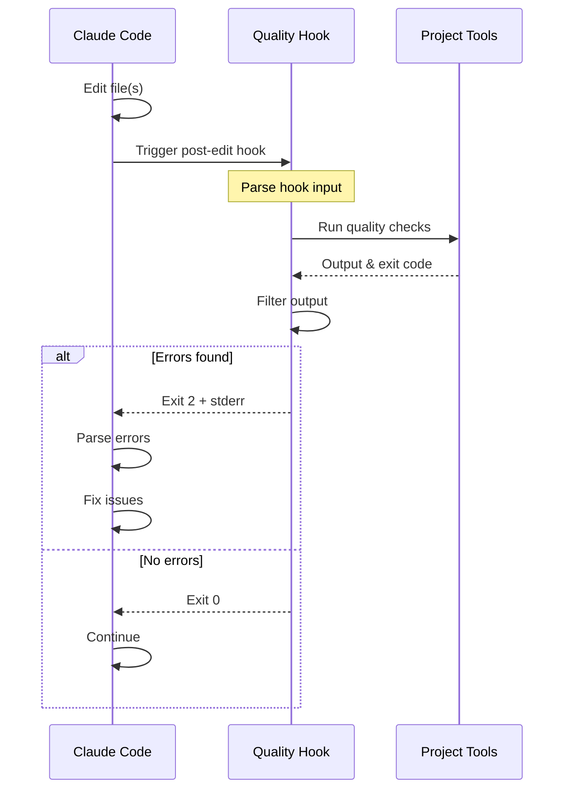

# Claude Code Integration Guide

## Table of Contents

1. [Overview](#overview)
2. [How Claude Code Hooks Work](#how-claude-code-hooks-work)
3. [Setting Up Quality Hook](#setting-up-quality-hook)
4. [Hook Configuration](#hook-configuration)
5. [File-Aware Integration](#file-aware-integration)
6. [Error Handling](#error-handling)
7. [Best Practices](#best-practices)
8. [Examples](#examples)
9. [Troubleshooting](#troubleshooting)

## Overview

Quality Hook is designed to integrate seamlessly with Claude Code's hook system, providing intelligent code quality feedback directly to the AI assistant. This integration enables Claude to automatically fix formatting issues, linting errors, type errors, and failing tests as it writes code.

### Key Integration Points

1. **Post-Edit Hook**: Runs after Claude modifies files
2. **Exit Code Communication**: Uses exit code 2 to signal errors
3. **Stderr Output**: Provides filtered error information to Claude
4. **File-Aware Execution**: Runs only relevant checks based on edited files
5. **LLM-Optimized Output**: Formats errors for AI comprehension

## How Claude Code Hooks Work

### Hook Lifecycle



### Hook Input Format

Claude Code provides information about the editing session via JSON input:

```json
{
  "session_id": "123e4567-e89b-12d3-a456-426614174000",
  "transcript_path": "/tmp/claude-transcript.json",
  "cwd": "/Users/developer/myproject",
  "hook_event_name": "post-edit",
  "tool_use": {
    "name": "Edit",
    "input": {
      "file_path": "/Users/developer/myproject/src/app.js"
    }
  }
}
```

### Exit Code Protocol

- **Exit 0**: No errors found, Claude continues normally
- **Exit 1**: Configuration or execution error (not quality issues)
- **Exit 2**: Quality issues found, Claude will read stderr and attempt fixes

## Setting Up Quality Hook

### Step 1: Install Quality Hook

```bash
# Install from source
go install github.com/bebsworthy/qualhook/cmd/qualhook@latest

# Or download pre-built binary
curl -L https://github.com/bebsworthy/qualhook/releases/latest/download/qualhook-$(uname -s)-$(uname -m) -o qualhook
chmod +x qualhook
sudo mv qualhook /usr/local/bin/
```

### Step 2: Configure Your Project

Run the configuration wizard:

```bash
qualhook config
```

This creates a `.qualhook.json` file with your project's quality commands.

### Step 3: Test Quality Hook

Verify it works correctly:

```bash
# Test individual commands
qualhook lint
qualhook test

# Test all commands
qualhook
```

### Step 4: Configure Claude Code

Add Quality Hook to your Claude Code settings:

```json
{
  "hooks": {
    "post-edit": "qualhook"
  }
}
```

Or if Quality Hook isn't in your PATH:

```json
{
  "hooks": {
    "post-edit": "/usr/local/bin/qualhook"
  }
}
```

## Hook Configuration

### Basic Hook Setup

The simplest configuration runs all quality checks after each edit:

```json
{
  "hooks": {
    "post-edit": "qualhook"
  }
}
```

### Specific Commands Only

Run only specific quality checks:

```json
{
  "hooks": {
    "post-edit": "qualhook lint"
  }
}
```

### Multiple Hooks

Chain multiple commands:

```json
{
  "hooks": {
    "post-edit": "qualhook format && qualhook lint"
  }
}
```

### Conditional Execution

Use shell scripting for conditional logic:

```json
{
  "hooks": {
    "post-edit": "[ -f .qualhook.json ] && qualhook || true"
  }
}
```

### Environment Variables

Pass configuration via environment:

```json
{
  "hooks": {
    "post-edit": "QUALHOOK_TIMEOUT=300000 qualhook"
  }
}
```

## File-Aware Integration

Quality Hook automatically detects which files Claude has edited and runs only the relevant checks. This is especially powerful for monorepos.

### How It Works

1. Claude Code provides edited file paths in hook input
2. Quality Hook maps files to project components using path patterns
3. Only runs checks for affected components
4. Reports which checks were run

### Configuration for File-Aware Mode

Define path-based rules in your `.qualhook.json`:

```json
{
  "version": "1.0",
  "paths": [
    {
      "path": "frontend/**/*.{js,jsx,ts,tsx}",
      "commands": {
        "format": {
          "command": "prettier",
          "args": ["--write", "frontend"]
        },
        "lint": {
          "command": "eslint",
          "args": ["frontend", "--fix"]
        }
      }
    },
    {
      "path": "backend/**/*.go",
      "commands": {
        "format": {
          "command": "gofmt",
          "args": ["-w", "backend"]
        },
        "lint": {
          "command": "golangci-lint",
          "args": ["run"],
          "workingDir": "backend"
        }
      }
    }
  ]
}
```

### Example Scenarios

#### Scenario 1: Frontend Change

Claude edits `frontend/src/App.tsx`:
- Runs: Frontend formatter and linter
- Skips: Backend checks
- Result: Faster feedback, relevant errors only

#### Scenario 2: Cross-Component Change

Claude edits both `frontend/api.ts` and `backend/handler.go`:
- Runs: Frontend checks for TypeScript file
- Runs: Backend checks for Go file
- Result: Comprehensive but targeted checking

#### Scenario 3: Documentation Change

Claude edits `README.md`:
- Runs: Documentation linter (if configured)
- Skips: Code quality checks
- Result: No unnecessary code checks

## Error Handling

### Error Output Format

Quality Hook formats errors for optimal Claude comprehension:

```
Fix the linting errors below:

src/components/Button.tsx
  23:5  error  'onClick' is missing in props validation  react/prop-types
  45:1  error  Missing semicolon                          semi

backend/api/users.go
  12:2  ineffectual assignment to err (ineffassign)
  34:5  error strings should not be capitalized (ST1005)
```

### Prompt Templates

Customize prompts for different commands:

```json
{
  "commands": {
    "format": {
      "prompt": "Apply these formatting changes:"
    },
    "lint": {
      "prompt": "Fix these code quality issues:"
    },
    "typecheck": {
      "prompt": "Resolve these type errors:"
    },
    "test": {
      "prompt": "Fix these failing tests:"
    }
  }
}
```

### Error Prioritization

Configure which errors are most important:

```json
{
  "outputFilter": {
    "errorPatterns": [
      { "pattern": "error", "flags": "i" }
    ],
    "priority": "errors",  // Focus on errors over warnings
    "maxOutput": 100
  }
}
```

## Best Practices

### 1. Start with Format and Lint

These provide immediate value with minimal setup:

```json
{
  "commands": {
    "format": {
      "command": "prettier",
      "args": ["--write", "."]
    },
    "lint": {
      "command": "eslint",
      "args": [".", "--fix"]
    }
  }
}
```

### 2. Use Auto-Fix Options

Enable auto-fixing where possible to reduce Claude's work:

```json
{
  "commands": {
    "lint": {
      "command": "eslint",
      "args": [".", "--fix"],  // Auto-fix what's possible
      "errorDetection": {
        "exitCodes": [1]  // Only unfixable errors remain
      }
    }
  }
}
```

### 3. Optimize Output for Claude

Keep error output concise and actionable:

```json
{
  "outputFilter": {
    "errorPatterns": [
      { "pattern": "^[^:]+:\\d+:\\d+:", "flags": "m" }
    ],
    "contextLines": 1,  // Minimal context
    "maxOutput": 50     // Prevent overwhelming
  }
}
```

### 4. Test Your Configuration

Before enabling hooks, verify output is helpful:

```bash
# Introduce an intentional error
echo "const x = 1" >> test.js

# Run Quality Hook
qualhook lint

# Check output is clear and actionable
# Remove test file
rm test.js
```

### 5. Use Monorepo Features

For complex projects, leverage path-based configuration:

```json
{
  "paths": [
    {
      "path": "packages/*/src/**",
      "commands": {
        "typecheck": {
          "command": "tsc",
          "args": ["--noEmit"]
        }
      }
    }
  ]
}
```

### 6. Handle Long-Running Commands

Set appropriate timeouts for slow commands:

```json
{
  "commands": {
    "test": {
      "command": "npm",
      "args": ["test"],
      "timeout": 300000  // 5 minutes for test suites
    }
  }
}
```

## Examples

### Example 1: React + TypeScript Project

```json
{
  "version": "1.0",
  "projectType": "react-typescript",
  "commands": {
    "format": {
      "command": "prettier",
      "args": ["--write", "src"],
      "errorDetection": {
        "exitCodes": [2]
      },
      "prompt": "Apply Prettier formatting:"
    },
    "lint": {
      "command": "eslint",
      "args": ["src", "--ext", ".ts,.tsx", "--fix"],
      "errorDetection": {
        "exitCodes": [1],
        "patterns": [
          { "pattern": "\\d+ errors?", "flags": "i" }
        ]
      },
      "outputFilter": {
        "errorPatterns": [
          { "pattern": "^\\s*\\d+:\\d+", "flags": "m" }
        ],
        "contextLines": 2,
        "maxOutput": 100
      },
      "prompt": "Fix ESLint errors:"
    },
    "typecheck": {
      "command": "tsc",
      "args": ["--noEmit", "--pretty", "false"],
      "errorDetection": {
        "exitCodes": [1, 2]
      },
      "outputFilter": {
        "errorPatterns": [
          { "pattern": "error TS\\d+:", "flags": "" }
        ],
        "contextLines": 0,
        "maxOutput": 75
      },
      "prompt": "Resolve TypeScript errors:"
    }
  }
}
```

### Example 2: Python Project

```json
{
  "version": "1.0",
  "projectType": "python",
  "commands": {
    "format": {
      "command": "black",
      "args": ["."],
      "errorDetection": {
        "exitCodes": [123]  // Black's error exit code
      },
      "prompt": "Apply Black formatting:"
    },
    "lint": {
      "command": "flake8",
      "args": [".", "--max-line-length=88"],
      "errorDetection": {
        "exitCodes": [1]
      },
      "outputFilter": {
        "errorPatterns": [
          { "pattern": "^[^:]+:\\d+:\\d+:", "flags": "m" }
        ],
        "maxOutput": 100
      },
      "prompt": "Fix Flake8 issues:"
    },
    "typecheck": {
      "command": "mypy",
      "args": ["."],
      "errorDetection": {
        "exitCodes": [1]
      },
      "outputFilter": {
        "errorPatterns": [
          { "pattern": "error:", "flags": "i" }
        ],
        "contextLines": 1,
        "maxOutput": 100
      },
      "prompt": "Fix type errors:"
    },
    "test": {
      "command": "pytest",
      "args": ["-v"],
      "timeout": 300000,
      "errorDetection": {
        "exitCodes": [1],
        "patterns": [
          { "pattern": "FAILED", "flags": "" }
        ]
      },
      "outputFilter": {
        "errorPatterns": [
          { "pattern": "FAILED", "flags": "" },
          { "pattern": "^E\\s+", "flags": "m" }
        ],
        "includePatterns": [
          { "pattern": "AssertionError", "flags": "" }
        ],
        "contextLines": 5,
        "maxOutput": 200
      },
      "prompt": "Fix failing tests:"
    }
  }
}
```

### Example 3: Full-Stack Monorepo

```json
{
  "version": "1.0",
  "commands": {
    "format": {
      "command": "echo",
      "args": ["No default formatter"]
    }
  },
  "paths": [
    {
      "path": "apps/web/**",
      "commands": {
        "format": {
          "command": "pnpm",
          "args": ["--filter", "web", "format"]
        },
        "lint": {
          "command": "pnpm",
          "args": ["--filter", "web", "lint"]
        },
        "typecheck": {
          "command": "pnpm",
          "args": ["--filter", "web", "typecheck"]
        }
      }
    },
    {
      "path": "apps/api/**",
      "commands": {
        "format": {
          "command": "cargo",
          "args": ["fmt"],
          "workingDir": "apps/api"
        },
        "lint": {
          "command": "cargo",
          "args": ["clippy", "--", "-D", "warnings"],
          "workingDir": "apps/api"
        },
        "test": {
          "command": "cargo",
          "args": ["test"],
          "workingDir": "apps/api",
          "timeout": 300000
        }
      }
    },
    {
      "path": "packages/**",
      "commands": {
        "typecheck": {
          "command": "pnpm",
          "args": ["-r", "typecheck"]
        },
        "test": {
          "command": "pnpm",
          "args": ["-r", "test"]
        }
      }
    }
  ]
}
```

## Troubleshooting

### Hook Not Running

1. **Check hook configuration**:
   ```bash
   # Verify hooks are set up
   cat ~/.claude/config.json | jq .hooks
   ```

2. **Test manually**:
   ```bash
   # Simulate hook execution
   echo '{"hook_event_name":"post-edit"}' | qualhook
   ```

### Errors Not Appearing

1. **Verify exit code**:
   ```bash
   qualhook lint
   echo $?  # Should be 2 for errors
   ```

2. **Check stderr output**:
   ```bash
   qualhook lint 2>&1 >/dev/null  # See only stderr
   ```

### Performance Issues

1. **Use file-aware execution**: Configure path patterns
2. **Reduce output size**: Lower `maxOutput` values
3. **Increase timeouts**: For slow commands
4. **Run fewer checks**: Use specific commands instead of all

### Debug Mode

Enable detailed logging:

```bash
# In Claude Code hook config
{
  "hooks": {
    "post-edit": "QUALHOOK_DEBUG=1 qualhook"
  }
}
```

Check logs for issues:
- Configuration loading problems
- Pattern matching failures
- Command execution errors
- Output filtering details

For more troubleshooting help, see the [Troubleshooting Guide](troubleshooting.md).