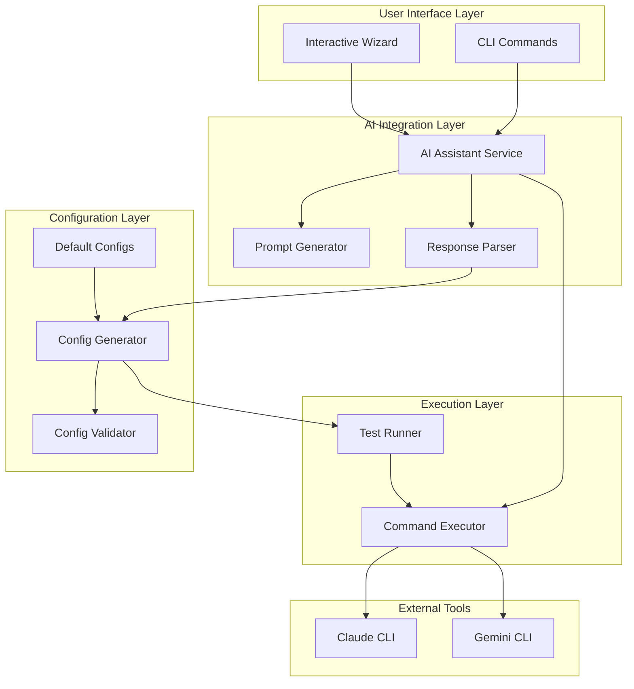
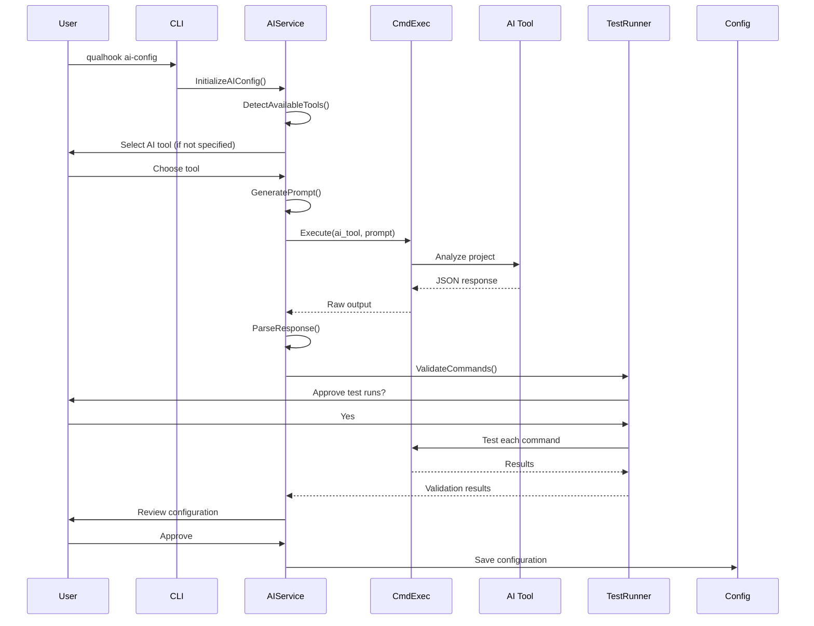
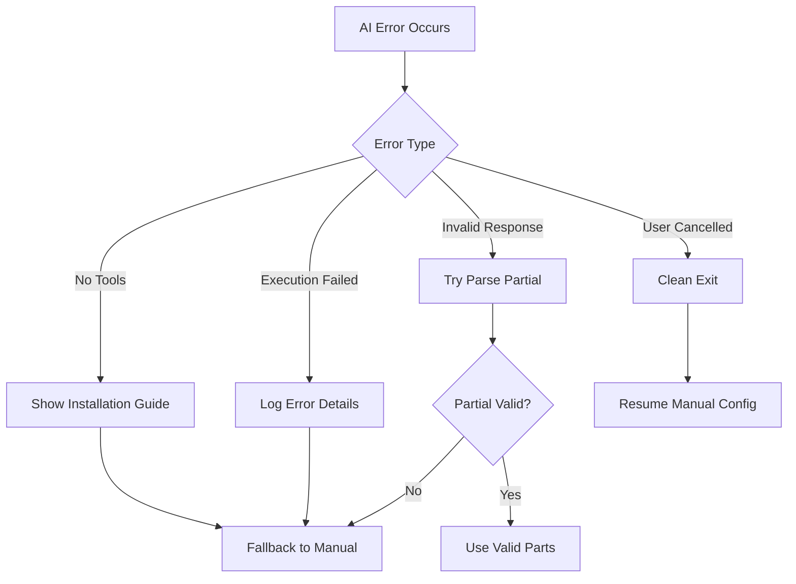

# Design Document

## Overview

The AI-Assisted Configuration feature enhances qualhook's configuration process by integrating AI tools (Claude and Gemini) to automatically analyze projects and generate appropriate quality check commands. The design leverages existing components while adding new AI integration capabilities that maintain user control and security.

### Key Design Principles
- **User Control**: All AI interactions require explicit user consent
- **Progressive Enhancement**: AI assistance enhances but doesn't replace manual configuration
- **Graceful Degradation**: System falls back to manual configuration on any AI failure
- **Security First**: AI tools run with restricted permissions and user approval for commands

## Architecture

### High-Level Architecture



### Component Interactions



## Components and Interfaces

### 1. AI Assistant Service (`internal/ai/assistant.go`)

```go
// Assistant provides AI-powered configuration generation
type Assistant struct {
    executor      *executor.CommandExecutor
    promptGen     *PromptGenerator
    parser        *ResponseParser
    toolDetector  *ToolDetector
}

// GenerateConfig generates a complete configuration using AI
func (a *Assistant) GenerateConfig(ctx context.Context, options AIOptions) (*config.Config, error)

// SuggestCommand suggests a command for a specific purpose
func (a *Assistant) SuggestCommand(ctx context.Context, commandType string, projectInfo ProjectInfo) (*CommandSuggestion, error)

// AIOptions configures AI assistance behavior
type AIOptions struct {
    Tool            string        // "claude" or "gemini", empty for user selection
    WorkingDir      string        // Project directory to analyze
    Interactive     bool          // Whether to show progress and allow cancellation
    TestCommands    bool          // Whether to test commands before returning
    Timeout         time.Duration // Maximum time for AI execution (0 = no limit)
}
```

### 2. Tool Detector (`internal/ai/detector.go`)

```go
// ToolDetector detects available AI CLI tools
type ToolDetector struct {
    executor *executor.CommandExecutor
}

// DetectTools returns available AI tools
func (d *ToolDetector) DetectTools() ([]Tool, error)

// Tool represents an available AI CLI tool
type Tool struct {
    Name      string // "claude" or "gemini"
    Command   string // Actual command to execute
    Version   string // Tool version if available
    Available bool   // Whether tool is installed and accessible
}
```

### 3. Prompt Generator (`internal/ai/prompt.go`)

```go
// PromptGenerator creates prompts for AI tools
type PromptGenerator struct {
    templates map[string]string
}

// GenerateConfigPrompt creates a prompt for full configuration generation
func (p *PromptGenerator) GenerateConfigPrompt(workingDir string) string

// GenerateCommandPrompt creates a prompt for specific command suggestion
func (p *PromptGenerator) GenerateCommandPrompt(commandType string, context ProjectContext) string

// ProjectContext provides context for prompt generation
type ProjectContext struct {
    ProjectType     string
    ExistingConfig  *config.Config
    CustomCommands  []string
}
```

### 4. Response Parser (`internal/ai/parser.go`)

```go
// ResponseParser parses AI tool responses
type ResponseParser struct {
    validator *config.Validator
}

// ParseConfigResponse parses a full configuration response
func (p *ResponseParser) ParseConfigResponse(response string) (*config.Config, error)

// ParseCommandResponse parses a single command suggestion
func (p *ResponseParser) ParseCommandResponse(response string) (*CommandSuggestion, error)

// CommandSuggestion represents an AI-suggested command
type CommandSuggestion struct {
    Command       string
    Args          []string
    ErrorPatterns []config.RegexPattern
    ExitCodes     []int
    Explanation   string // Why this command was suggested
}
```

### 5. Interactive Progress (`internal/ai/progress.go`)

```go
// ProgressIndicator shows AI execution progress
type ProgressIndicator struct {
    startTime   time.Time
    cancelled   chan bool
    spinner     *spinner.Spinner
}

// Start begins showing progress
func (p *ProgressIndicator) Start(message string)

// Stop stops the progress indicator
func (p *ProgressIndicator) Stop()

// WaitForCancellation waits for ESC key press
func (p *ProgressIndicator) WaitForCancellation(ctx context.Context) <-chan bool
```

### 6. Test Runner (`internal/ai/tester.go`)

```go
// TestRunner validates commands by executing them
type TestRunner struct {
    executor *executor.CommandExecutor
    ui       *InteractiveUI
}

// TestCommands tests a set of commands with user approval
func (t *TestRunner) TestCommands(ctx context.Context, commands map[string]*config.CommandConfig) (map[string]TestResult, error)

// TestResult contains command test results
type TestResult struct {
    Success      bool
    Output       string
    Error        error
    Modified     bool                    // Whether user modified the command
    FinalCommand *config.CommandConfig   // Final command after modifications
}
```

### 7. Wizard Enhancement (`internal/wizard/ai_integration.go`)

```go
// AIIntegration adds AI capabilities to the configuration wizard
type AIIntegration struct {
    assistant *ai.Assistant
    ui        *InteractiveUI
}

// EnhanceCommand suggests improvements for a command
func (a *AIIntegration) EnhanceCommand(ctx context.Context, commandType string, current *config.CommandConfig) (*config.CommandConfig, error)

// ReviewCommands presents all commands for review with AI options
func (a *AIIntegration) ReviewCommands(ctx context.Context, commands map[string]*config.CommandConfig) error
```

### 8. CLI Command (`cmd/qualhook/ai-config.go`)

```go
var aiConfigCmd = &cobra.Command{
    Use:   "ai-config",
    Short: "Generate configuration using AI assistance",
    Long:  `Automatically generate .qualhook.json by analyzing your project with Claude or Gemini`,
    RunE:  runAIConfig,
}

func runAIConfig(cmd *cobra.Command, args []string) error
```

## Data Models

### 1. AI Response Format

```json
{
  "version": "1.0",
  "projectType": "nodejs",
  "monorepo": {
    "detected": true,
    "type": "yarn-workspaces",
    "workspaces": ["packages/backend", "packages/frontend"]
  },
  "commands": {
    "format": {
      "command": "prettier",
      "args": ["--write", "."],
      "errorPatterns": [
        {"pattern": "\\[error\\]", "flags": "i"}
      ],
      "exitCodes": [1, 2]
    },
    "lint": {
      "command": "eslint",
      "args": [".", "--fix"],
      "errorPatterns": [
        {"pattern": "\\d+ problems? \\(\\d+ errors?, \\d+ warnings?\\)", "flags": ""}
      ],
      "exitCodes": [1]
    },
    "typecheck": {
      "command": "tsc",
      "args": ["--noEmit"],
      "errorPatterns": [
        {"pattern": "error TS\\d+:", "flags": ""}
      ],
      "exitCodes": [1, 2]
    },
    "test": {
      "command": "jest",
      "args": ["--passWithNoTests"],
      "errorPatterns": [
        {"pattern": "FAIL", "flags": ""}
      ],
      "exitCodes": [1]
    }
  },
  "paths": [
    {
      "path": "packages/backend/**",
      "commands": {
        "test": {
          "command": "jest",
          "args": ["--config", "packages/backend/jest.config.js"]
        }
      }
    }
  ],
  "customCommands": {
    "build": {
      "command": "yarn",
      "args": ["build"],
      "explanation": "Detected build script in package.json"
    }
  }
}
```

### 2. Tool Selection State

```go
type ToolSelectionState struct {
    AvailableTools []Tool
    SelectedTool   string
    UserConsent    bool
    Timestamp      time.Time
}
```

### 3. Progress State

```go
type ProgressState struct {
    Phase       string        // "detecting", "analyzing", "parsing", "testing"
    StartTime   time.Time
    ElapsedTime time.Duration
    Cancellable bool
    Message     string
}
```

## Error Handling

### 1. AI Tool Errors

```go
var (
    ErrNoAIToolsAvailable = errors.New("no AI tools available")
    ErrAIToolNotFound     = errors.New("specified AI tool not found")
    ErrAIExecutionFailed  = errors.New("AI tool execution failed")
    ErrAIResponseInvalid  = errors.New("AI response parsing failed")
    ErrUserCancelled      = errors.New("operation cancelled by user")
)
```

### 2. Error Recovery Strategy



### 3. Fallback Mechanisms

- **No AI Tools**: Provide platform-specific installation instructions
- **AI Timeout**: User can cancel and continue manually
- **Invalid Response**: Attempt to extract valid portions
- **Command Test Failure**: Allow user to modify and retry
- **Network Issues**: Detect and inform user to check connectivity

## Testing Strategy

### 1. Unit Tests

```go
// internal/ai/assistant_test.go
func TestAssistant_GenerateConfig(t *testing.T)
func TestAssistant_HandleCancellation(t *testing.T)
func TestAssistant_ToolSelection(t *testing.T)

// internal/ai/parser_test.go
func TestParser_ParseValidResponse(t *testing.T)
func TestParser_ParsePartialResponse(t *testing.T)
func TestParser_HandleMalformedJSON(t *testing.T)

// internal/ai/prompt_test.go
func TestPromptGenerator_GenerateConfigPrompt(t *testing.T)
func TestPromptGenerator_IncludeMonorepoInstructions(t *testing.T)
```

### 2. Integration Tests

```go
// internal/ai/integration_test.go
func TestAIConfig_EndToEnd(t *testing.T)
func TestAIConfig_WithMockAITool(t *testing.T)
func TestWizard_AIEnhancement(t *testing.T)
```

### 3. Mock AI Tool for Testing

```go
// internal/testutil/mock_ai.go
type MockAITool struct {
    responses map[string]string
    delay     time.Duration
}

func (m *MockAITool) Execute(prompt string) (string, error)
```

### 4. Test Scenarios

- **Happy Path**: AI tool returns valid configuration
- **Partial Success**: Some commands valid, others need fixing
- **Tool Unavailable**: No AI tools installed
- **User Cancellation**: User presses ESC during execution
- **Command Test Failures**: Suggested commands don't work
- **Monorepo Detection**: Complex workspace structures
- **Security Validation**: AI suggests dangerous commands

## Security Considerations

### 1. Command Validation

- All AI-suggested commands go through existing `SecurityValidator`
- Dangerous commands are rejected before testing
- User must approve each command test

### 2. Privacy Protection

- AI tools run in project directory with normal user permissions
- Prompts instruct AI to respect .gitignore
- No file contents are logged or transmitted

### 3. Execution Isolation

- Command tests run with timeout protection
- Tests execute in restricted environment
- Output is sanitized before display

## Performance Optimizations

### 1. Concurrent Operations

- Tool detection runs in parallel
- Command tests can run concurrently with user approval
- Progress updates don't block main execution

### 2. Caching Strategy

- Cache tool availability for session duration
- Remember user's tool selection for current run
- Cache parsed responses for retry scenarios

### 3. Resource Management

- Limit AI tool memory usage through system limits
- Cancel long-running operations cleanly
- Clean up temporary files after execution