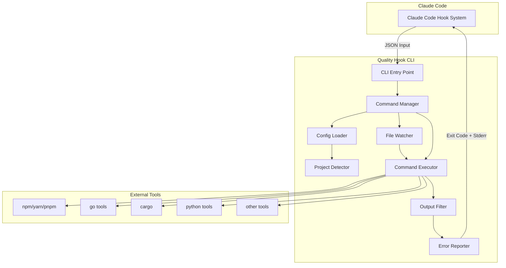
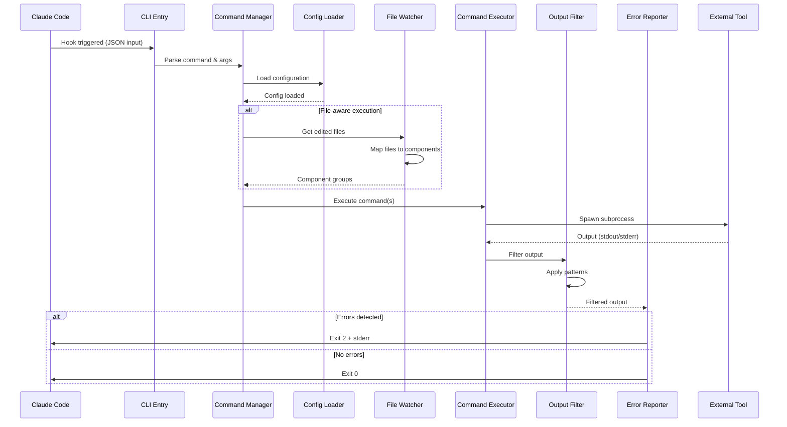
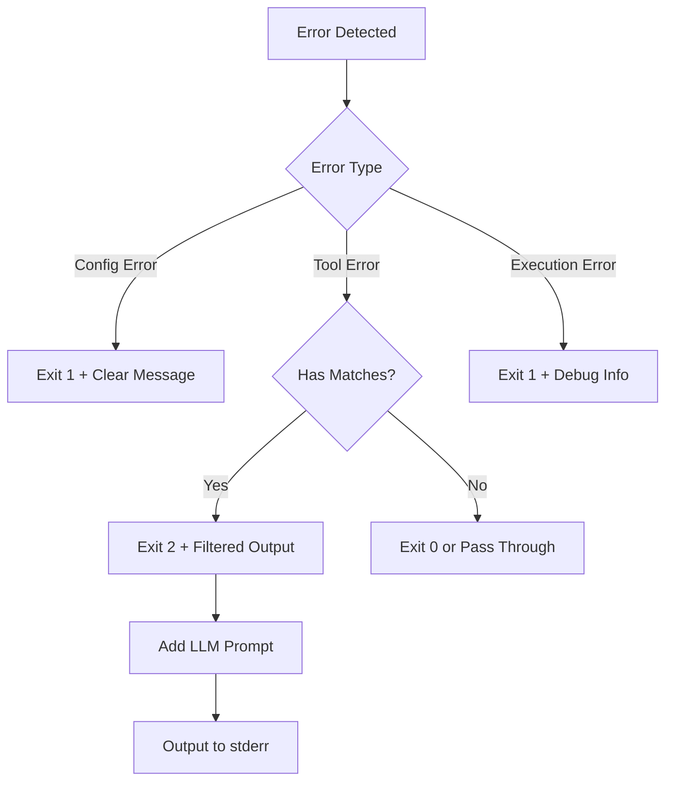

# Design Document: Quality Hook

## Overview

Quality Hook is a configurable CLI tool that wraps project-specific quality commands (format, lint, typecheck, test) and intelligently filters their output for Claude Code LLM consumption. The tool uses a configuration-driven architecture to support any project type without hardcoding, with special support for monorepos and file-aware execution.

### Key Design Principles
- **Configuration-driven**: All project-specific logic lives in configuration files
- **Zero implementation**: Delegates all actual work to project tools
- **Smart filtering**: Extracts only relevant error information
- **Monorepo-aware**: Path-based configuration with file-aware execution
- **LLM-optimized**: Outputs formatted for Claude Code consumption

## Technology Choice

### Implementation Language: Go

Go has been selected as the implementation language for Quality Hook based on the following criteria:

**Advantages:**
- **Single Binary Distribution**: Go compiles to a single executable, making installation simple across all platforms
- **Cross-Platform Support**: Excellent support for Windows, macOS, and Linux with easy cross-compilation
- **Performance**: Fast startup time and efficient execution, meeting our <100ms overhead requirement
- **Subprocess Management**: Built-in `exec` package for safe command execution
- **Concurrency**: Goroutines enable efficient parallel execution for monorepo scenarios
- **CLI Libraries**: Mature ecosystem with libraries like Cobra for CLI development
- **JSON Handling**: Native JSON support for configuration parsing

**Note on Interface Documentation:**
The TypeScript syntax used throughout this design document is purely for documentation clarity. The actual implementation will be in Go, following Go idioms and best practices.

## Architecture

### High-Level Architecture



### Component Flow



## Components and Interfaces

### 1. CLI Entry Point (`main`)
**Purpose**: Parse command-line arguments and route to appropriate handlers

**Interface**:
```typescript
interface CLIArgs {
  command: string; // format, lint, typecheck, test, config, or custom
  args: string[];
  debug: boolean;
  help: boolean;
}
```

### 2. Command Manager
**Purpose**: Orchestrate command execution based on configuration

**Interface**:
```typescript
interface CommandManager {
  execute(command: string, args: CLIArgs): Promise<number>;
  validateCommand(command: string): boolean;
}
```

### 3. Configuration Loader
**Purpose**: Load and validate JSON configuration files

**Interface**:
```typescript
interface ConfigLoader {
  load(): Promise<Config>;
  validate(config: Config): ValidationResult;
  getConfigPath(): string;
}
```

### 4. Project Detector
**Purpose**: Auto-detect project types based on file markers

**Interface**:
```typescript
interface ProjectDetector {
  detect(path: string): Promise<ProjectType[]>;
  getDefaultConfig(type: ProjectType): CommandConfig;
}

interface ProjectType {
  name: string; // "nodejs", "go", "rust", etc.
  confidence: number; // 0-1
  markers: string[]; // Files that identified this type
}
```

### 5. File Watcher
**Purpose**: Map edited files to project components for monorepo support

**Interface**:
```typescript
interface FileWatcher {
  getEditedFiles(): string[]; // From Claude Code input
  mapToComponents(files: string[]): ComponentGroup[];
}

interface ComponentGroup {
  path: string;
  files: string[];
  config: CommandConfig;
}
```

### 6. Command Executor
**Purpose**: Execute external commands with proper error handling

**Interface**:
```typescript
interface CommandExecutor {
  execute(command: string, args: string[], options: ExecOptions): Promise<ExecResult>;
}

interface ExecOptions {
  cwd?: string;
  timeout?: number;
  env?: Record<string, string>;
}

interface ExecResult {
  stdout: string;
  stderr: string;
  exitCode: number;
  timedOut: boolean;
}
```

### 7. Output Filter
**Purpose**: Apply regex patterns to extract relevant error information

**Interface**:
```typescript
interface OutputFilter {
  filter(output: string, rules: FilterRules): FilteredOutput;
}

interface FilterRules {
  errorPatterns: RegexPattern[];
  contextPatterns: RegexPattern[];
  maxLines: number;
  priority: "errors" | "warnings" | "all";
}

interface FilteredOutput {
  lines: string[];
  hasErrors: boolean;
  truncated: boolean;
}
```

### 8. Error Reporter
**Purpose**: Format errors for LLM consumption and determine exit codes

**Interface**:
```typescript
interface ErrorReporter {
  report(results: CommandResult[]): ReportResult;
}

interface ReportResult {
  exitCode: number;
  stderr: string;
  stdout?: string;
}
```

## Data Models

### Configuration Schema

```typescript
interface Config {
  version: string; // Schema version
  projectType?: string; // Optional project type hint
  commands: Record<string, CommandConfig>;
  paths?: PathConfig[]; // For monorepo support
}

interface CommandConfig {
  command: string; // Actual command to run
  args?: string[]; // Additional arguments
  errorDetection: ErrorDetection;
  outputFilter: FilterConfig;
  prompt?: string; // LLM prompt template
  timeout?: number; // Command timeout in ms
}

interface ErrorDetection {
  exitCodes?: number[]; // Which exit codes indicate errors
  patterns?: RegexPattern[]; // Patterns in output indicating errors
}

interface FilterConfig {
  errorPatterns: RegexPattern[];
  contextLines?: number; // Lines of context around errors
  maxOutput?: number; // Max lines to output
  includePatterns?: RegexPattern[]; // Additional patterns to include
}

interface RegexPattern {
  pattern: string; // Regex pattern
  flags?: string; // Regex flags
}

interface PathConfig {
  path: string; // Glob pattern for path matching
  extends?: string; // Base config to extend
  commands: Record<string, CommandConfig>;
}
```

### Example Configuration

```json
{
  "version": "1.0",
  "commands": {
    "format": {
      "command": "npm",
      "args": ["run", "format"],
      "errorDetection": {
        "exitCodes": [1]
      },
      "outputFilter": {
        "errorPatterns": [
          { "pattern": "error", "flags": "i" }
        ],
        "maxOutput": 50
      },
      "prompt": "Fix the formatting issues below:"
    },
    "lint": {
      "command": "npm",
      "args": ["run", "lint"],
      "errorDetection": {
        "exitCodes": [1],
        "patterns": [
          { "pattern": "\\d+ errors?", "flags": "i" }
        ]
      },
      "outputFilter": {
        "errorPatterns": [
          { "pattern": "error", "flags": "i" },
          { "pattern": "^\\s*\\d+:\\d+", "flags": "m" }
        ],
        "contextLines": 2,
        "maxOutput": 100
      },
      "prompt": "Fix the linting errors below:"
    }
  },
  "paths": [
    {
      "path": "frontend/**",
      "commands": {
        "lint": {
          "command": "npm",
          "args": ["run", "lint", "--prefix", "frontend"]
        }
      }
    },
    {
      "path": "backend/**",
      "commands": {
        "lint": {
          "command": "go",
          "args": ["vet", "./..."],
          "errorDetection": {
            "exitCodes": [1]
          }
        }
      }
    }
  ]
}
```

### Claude Code Hook Input

```typescript
interface HookInput {
  session_id: string;
  transcript_path: string;
  cwd: string;
  hook_event_name: string;
  tool_use?: {
    name: string;
    input: {
      file_path?: string;
      // Other tool-specific fields
    };
  };
}
```

## Error Handling

### Error Categories

1. **Configuration Errors**
   - Missing configuration file
   - Invalid JSON syntax
   - Schema validation failures
   - Missing required fields

2. **Execution Errors**
   - Command not found
   - Permission denied
   - Working directory not found
   - Timeout exceeded

3. **Tool Errors**
   - Non-zero exit codes from tools
   - Pattern-matched errors in output
   - Tool-specific error formats

### Error Response Strategy



### Error Message Format

```
[QUALHOOK ERROR] <Category>: <Message>

Details:
- <Specific information>
- <Suggestions for fix>

Debug with: qualhook --debug <command>
```

## Testing Strategy

### Unit Tests

1. **Configuration Loader**
   - Valid/invalid JSON parsing
   - Schema validation
   - Path resolution
   - Default value handling

2. **Project Detector**
   - Single project type detection
   - Multiple project types
   - Monorepo detection
   - Unknown project handling

3. **Output Filter**
   - Pattern matching accuracy
   - Context line extraction
   - Output truncation
   - Priority filtering

4. **File Watcher**
   - Path to component mapping
   - Glob pattern matching
   - Precedence rules
   - Fallback handling

### Integration Tests

1. **Command Execution**
   - Mock external tools
   - Timeout handling
   - Signal handling
   - Environment isolation

2. **End-to-End Flows**
   - Format command with no errors
   - Lint command with errors
   - Monorepo with multiple components
   - Custom command execution

### Test Data

```
test/
├── fixtures/
│   ├── configs/
│   │   ├── simple.json
│   │   ├── monorepo.json
│   │   └── invalid.json
│   ├── outputs/
│   │   ├── eslint-errors.txt
│   │   ├── go-vet-output.txt
│   │   └── prettier-success.txt
│   └── projects/
│       ├── nodejs/
│       ├── golang/
│       └── monorepo/
└── mocks/
    └── external-tools/
```

### Performance Tests

1. **Output Processing**
   - Large output handling (>10MB)
   - Regex performance on various inputs
   - Memory usage during streaming

2. **Startup Time**
   - Configuration loading overhead
   - Project detection caching
   - Cold start vs warm start

## Security Considerations

### Command Injection Prevention

```go
// Safe command execution in Go
func executeCommand(cmdName string, args []string) error {
    // Use exec.Command which doesn't invoke shell
    cmd := exec.Command(cmdName, args...)
    
    // Set working directory
    cmd.Dir = workingDir
    
    // Limit environment variables
    cmd.Env = filterEnvironment(os.Environ())
    
    return cmd.Run()
}
```

### Path Traversal Prevention

```go
func validatePath(inputPath string) (string, error) {
    // Clean and resolve the path
    cleaned := filepath.Clean(inputPath)
    absPath, err := filepath.Abs(cleaned)
    if err != nil {
        return "", err
    }
    
    // Ensure path is within project bounds
    cwd, _ := os.Getwd()
    if !strings.HasPrefix(absPath, cwd) {
        return "", fmt.Errorf("path outside project directory")
    }
    
    return absPath, nil
}
```

### Configuration Validation

- Whitelist allowed commands
- Validate regex patterns
- Limit resource usage (timeouts, output size)
- Sanitize file paths

## Go Implementation Details

### Recommended Libraries

- **CLI Framework**: [Cobra](https://github.com/spf13/cobra) - Industry standard for Go CLIs
- **Configuration**: Standard library `encoding/json`
- **File Matching**: [doublestar](https://github.com/bmatcuk/doublestar) for glob patterns
- **Process Execution**: Standard library `os/exec`
- **Concurrent Execution**: Native goroutines and channels

### Project Structure

```
qualhook/
├── cmd/
│   └── qualhook/
│       └── main.go          # Entry point
├── internal/
│   ├── config/
│   │   ├── loader.go        # Configuration loading
│   │   └── validator.go     # Schema validation
│   ├── executor/
│   │   ├── command.go       # Command execution
│   │   └── parallel.go      # Parallel execution for monorepos
│   ├── filter/
│   │   ├── output.go        # Output filtering
│   │   └── patterns.go      # Regex pattern management
│   ├── detector/
│   │   └── project.go       # Project type detection
│   └── reporter/
│       └── error.go         # Error formatting
├── pkg/
│   └── types/
│       └── config.go        # Shared types
├── go.mod
├── go.sum
└── README.md
```

### Parallel Execution for Monorepos

```go
// Execute commands for multiple components in parallel
func executeParallel(groups []ComponentGroup) []Result {
    var wg sync.WaitGroup
    results := make([]Result, len(groups))
    
    for i, group := range groups {
        wg.Add(1)
        go func(idx int, g ComponentGroup) {
            defer wg.Done()
            results[idx] = executeForComponent(g)
        }(i, group)
    }
    
    wg.Wait()
    return results
}
```

---

Does the design look good? If so, we can move on to the implementation plan.